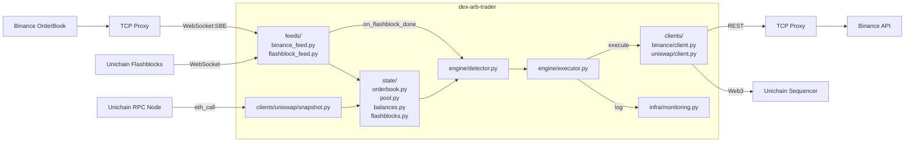

[](https://github.com/pylint-dev/pylint)
[](https://github.com/psf/black)


# DEX Arbitrage Trader

**Author: Tobias Zenner**

I am the sole author of this repository; all code and architecture are my own work.


**dex-arb-trader** is a live arbitrage trading engine between:
- **CEX**: Binance (ETH/USDC, Spot, SBE WebSocket feed + REST trading)
- **DEX**: Uniswap v4 pool on **Unichain mainnet** (ETH/USDC, 5bps pool)

It is built for low-latency, event-driven arbitrage with:
- WebSocket market data (Binance SBE + Unichain flashblocks)
- On-chain execution via eth_sendBundle to L2 sequencer
- Binance execution via REST API with custom Binance TCP proxy
- Production deployment on co-located AWS EC2 instances
- Docker support

## Table of Contents
- [DEX Arbitrage Trader](#dex-arbitrage-trader)
  - [Architecture](#architecture)
  - [Project Structure](#project-structure)
    - [Smart Contract](#smart-contract)
    - [Trading Bot](#trading-bot)
  - [Deployment](#deployment)
  - [Latency & Measurements](#latency--measurements)
  - [Strategy & Design Choices](#strategy--design-choices)
  - [Next Steps](#next-steps)
  - [Setup and Usage](#setup-and-usage)

## Architecture



## Project Structure
dex-arb-trader is structured into two main components: the smart contract for tick bitmap management and the trading bot for arbitrage detection and execution.
### Smart Contract
```
contracts/
├── script/
│   └── DeployTickBitmapHelper.s.sol        # Deployment scripts for TickBitmapHelper contract
├── src/
│   └── TickBitmapHelper.sol                # Smart contract for tick bitmap management
└── test/
   └── TickBitmapHelper.t.sol               # Test cases for TickBitmapHelper.sol
```

### Trading Bot
```
src/
├── clients/
│   ├── binance/
│   │   └── client.py          # Binance REST client
│   └── uniswap/
│       ├── client.py          # Uniswap v4 Web3 client
│       └── snapshot.py        # Uniswap pool snapshot logic
├── engine/
│   ├── detector.py            # Arbitrage detection logic
│   └── executor.py            # Trade execution logic
├── feeds/
│   ├── binance_feed.py        # Binance SBE WebSocket feed handler
│   └── flashblock_feed.py     # Unichain flashblock feed handler
├── infra/
│   ├── monitoring.py          # Monitoring and logging utilities
│   ├── web3.py                # Web3 connection management
│   └── ws.py                  # WebSocket connection management
├── state/
│   ├── balances.py            # Account balance tracking
│   ├── flashblocks.py         # Flashblock state management
│   ├── orderbook.py           # Order book state management
│   └── pool.py                # Uniswap pool state management
├── main.py                    # Main entry point
└── config.py                  # Configuration management
```

## Production Infrastructure
- ec2 t3.nano instance in us-east-2 (Ohio): Main bot process `dex-arb-trader`
- ec2 t3.nano instance in ap-northeast-1 (Tokio): Runs `nginx` as TCP Passthrough Proxy for Binance REST + WebSocket SBE

## Latency & Measurements
Binance OrderBook -> TODO: add chart + measurements


## Strategy & Design Choices
- Instrument: ETHU/USDC on Binance Spot and Uniswap V4 Pool on Unichain (5 bps pool fee)
- Edge calculation:
    - each flashblock, calculate bid/ask using local pool state and binance order book state incl. fees
    - trade volume is taking market impact and fees into account
- Execution Sequence:
    1. eth_sendBundle to Unichain with minAmountIn/minAmountOut = Binance Bid/Ask incl. fees
    1. REST API to Binance **after** eth_sendBundle successful tx (TODO: add note why - very little slippage on Binance observed)
- Risk management:
    - Failed bundles are not executed on-chain and do not consume gas. Remaining risk is Binance slippage (ref. to note)
    - Slippage in Binance was found to be positive compared to setup with parallel execution on average

## Next Steps
- Increase number of exchanges (CEX + DEX)
- Support for multiple trading pairs

## Setup and Usage
Requirements:
- Python >= `3.12`
- pip3
- Linux environment (or WSL on Windows)

Populate the `.env` using template `.env.example`.

Setup a virtual environment using:
```
python -m venv .venv
```

To start the bot, run:
```
./startTrading.sh
```

To build and push the Docker image, run:
```
./build.sh
```